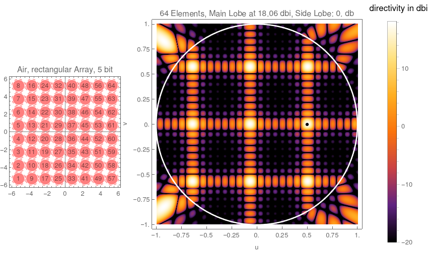
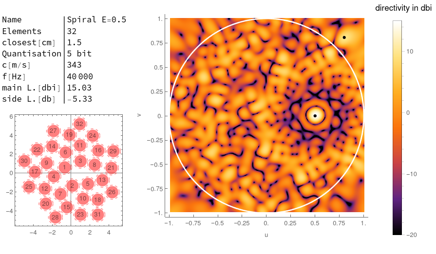

# Phased Array

This project is developing a phased array using cheap (0.80€) ultrasonic (40kHz) transducers like [here](https://www.aliexpress.com/item/32294219722.html?gatewayAdapt=glo2deu&spm=a2g0o.9042311.0.0.51394c4dT7BWEK).\
The main problem is the diameter of the transducers with 1.3 &lambda; in air which is over the rule of thumb for the maximal distance between elements with 0.5 &lambda;.\
First 3D printed waveguides were researched to get the emitting apertures closer.\
This causes a large loss of power which isn't feasible.\
Therefore sparse spiral array patterns are currently researched, showing promising results.

## Motivation: Localisation of an ROV

This project is for the localisation of the ROV [SIMLASUB](http://www.github.com/simlasub) which is being build by students it the [Schüler-Forschungs-Zentrum Überlingen](https://sfz-bw.de/ueberlingen/).

For the localisation of the ROV a phased array will be mounted on a boat and a single Transducer on the ROV to simplify the electronics of the ROV.\
For simplification of the problem a line of sight between the ROV and the boat is required.

Due to relatively simple and precise depth measurement with the pressure Sensor MS5837-30BA (2mm resolution down to 300m) it is sufficient to now the direction of the ROV from the boat for calculating the relative location to the boat. And with GPS the absolute location.

Two modes of operation are currently planned:

1. scanning mode: The phased array is electronically scanned over the entire search region and the direction of the strongest signal is the direction of the ROV, because reflections lose signal strength.\
To reduce false measurements the side lobe directivity should be much lower than the main lobe directivity.

This procedure could take some time if the phased Array does the mixing of the signals in hardware, which is simpler to implement. Therefore a second mode is planned:

2. tracking mode: If an old position is already know the current position can be estimated with an EKF (extended Kalman filter) and (acceleration, gyroscope, compass and steering) data from the ROV with the MPU6000 sensor.\
Therefore the position only has to be refined. This reduces the search space dramatically to a few degrees.\
Therefore the main lobe width should be optimised. This is measured as the main lobe HPFW (half-power full-width).

Optionally the hardware could be used for a third mode:

3. imaging mode: In the future the scanning data could be used for imaging the multipath reflections.\
This would be useful for navigation with the ROV.

## Simulations

For simpler testing a phased array in air (c = 343m/s) is researched.\
This mainly done using Mathematica. The code can be found in [sim](./sim/).

For a grid Array the rule of thumb is a element spacing of less than 0.5 &lambda;.
The closest the cheap 15mm large Transducers can be spaced is 1.3 &lambda;.

To calculate the directivity the transducers were modeled as point sources sending a spherical wave and interference calculated at the far field.\
The resulting data is plotted below.
The red plot (bottom, left) shows the array geometry the plot on the right he directivity. The u,v Coordinates represent the angle. The data outside the unit circle is invalid.

The side lobe level is has a difference of 0db from the main lobe. Therefore this array cant be used for scanning.

## Waveguides

To reduce the distance between the elements 3D printed waveguides can be used. This was already researched for example [3D Imaging Method for an Air-Coupled 40 kHz Ultrasound Phased-Array, Gianni Allevato et al.](https://pub.dega-akustik.de/ICA2019/data/articles/000220.pdf) and [Airborne ultrasound phased arrays, Axel Jaeger](https://tuprints.ulb.tu-darmstadt.de/9005/7/20191016-Dissertation-Axel-Jaeger.pdf).

For researching different waveguide shapes [2D](./sim/2D/) and [3D](./sim/3D/) FEM (finite element method) simulations of the pressure field around the transducers were evaluated.\
The following image shows a plot of the data from a simple 2D [simulation](./sim/2D/single_transducer.nb).

The problem is the intensity reduction of around 15 db.

## Array geometry (in progress)

Side lobes can also be reduced by tapering the power of the elements.
This can be done electronically or mechanically by reducing the density of elements at the edges of the array like in [Sunflower Array Antenna with Adjustable Density Taper, Maria Carolina Viganó et al.](https://www.semanticscholar.org/paper/Sunflower-Array-Antenna-with-Adjustable-Density-Vigan%C3%B3-Toso/11fbf66164cc196a3323513aaaddc71ceded2d92).

This can be simplified by using a spiral array geometries. 
The spiral is given with r(&phi;) = &phi;E with the Exponent E. The points are selected with the golden angle &phi;n = n * &pi;[ 3-sqrt(5)].

Here is an example:

The results of a couple more  Tests:

| Name  | Elements |Main Lobe Directivity | Side Lobe Level |
| ------------- | ----| ------------- | ----|
| [rect 8x8](./sim/res/air/rect64.png)  | 64 | 18 dbi  | 0 dbi|
| [tri 8x8](./sim/res/air/tri17.png)  | 17 | 12 dbi  | 0 dbi|
| [spiral E=0.5](./sim/res/air/0.5Spiral32.png)  | 32 | 15 dbi  | -5 dbi|
| [spiral E=0.75](./sim/res/air/0.75Spiral32.png)  | 32 | 15 dbi  | -10 dbi|
| [spiral E=1](./sim/res/air/1.0Spiral32.png)  | 32 | 15 dbi  | -10 dbi|
| [spiral E=1.25](./sim/res/air/1.25Spiral32.png)  | 32 | 15 dbi  | -10 dbi|
| [spiral E=1](./sim/res/air/1.0Spiral08.png)  | 08 | 9 dbi  | -0.9 dbi|
| [spiral E=1](./sim/res/air/1.0Spiral12.png)  | 12 | 11 dbi  | -6 dbi|
| [spiral E=1](./sim/res/air/1.0Spiral16.png)  | 16 | 12 dbi  | -5 dbi|
| [spiral E=1](./sim/res/air/1.0Spiral32.png)  | 32 | 15 dbi  | -10 dbi|
| [spiral E=1 symmetric](./sim/res/air/1.0Spiral2Sym16.png)  | 16 | 12 dbi  | -4 dbi|
| [spiral E=1 symmetric](./sim/res/air/1.0Spiral2Sym32.png)  | 32 | 15 dbi  | -10 dbi|
